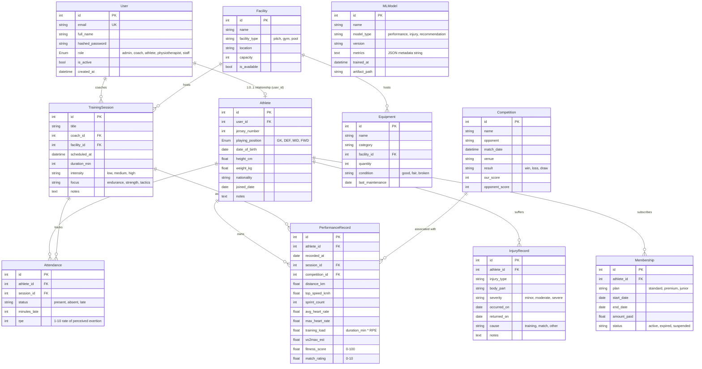
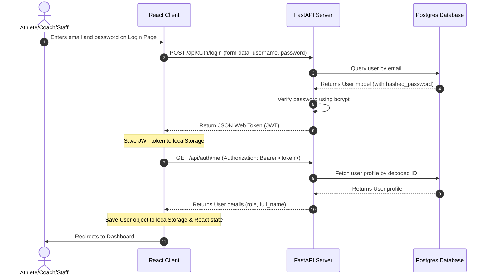
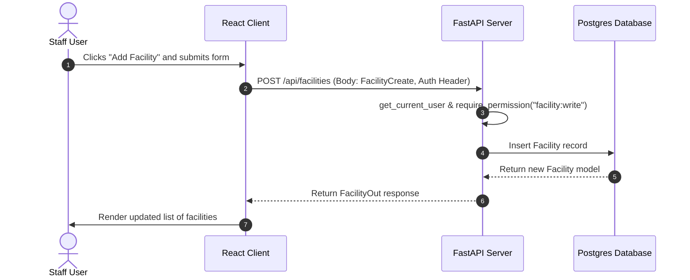
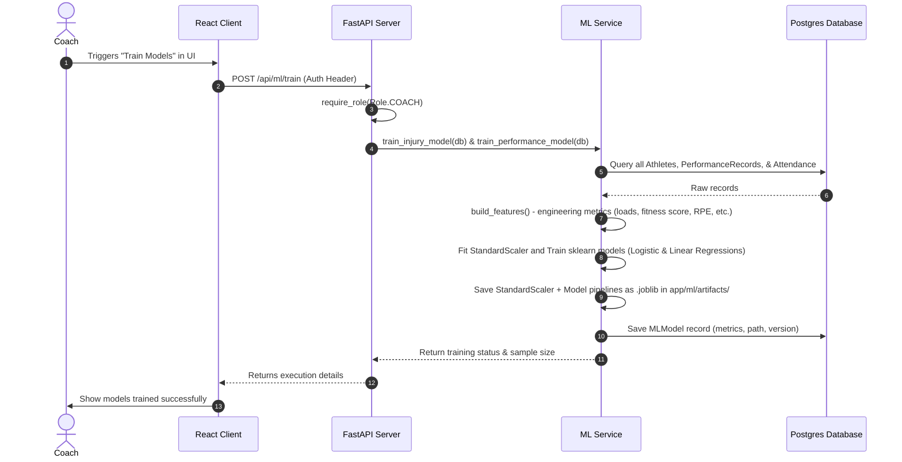

# Architecture Documentation - Sports Club AI

This document provides a comprehensive overview of the Sports Club AI codebase, detailing the tech stack, project structure, database models, state management, and key data flows.

---

## 1. Tech Stack

### Backend
- **Framework:** [FastAPI](https://fastapi.tiangolo.com/) (v0.115.0+) for high-performance, asynchronous REST API endpoints.
- **ORM:** [SQLAlchemy](https://www.sqlalchemy.org/) (v2.0.35+) with declarative mapping.
- **Database Migrations:** [Alembic](https://alembic.mangolassi.org/) (v1.13.0+) for database schema management.
- **Validation & Serialization:** [Pydantic](https://docs.pydantic.dev/) (v2.9.0+) for type validation and JSON serialization schemas.
- **Security:**
  - `bcrypt` for secure password hashing.
  - `python-jose` for generating and verifying HMAC-SHA256 Signed JSON Web Tokens (JWT).
  - FastAPI OAuth2 Password Bearer flow for token-based API authentication.
- **Machine Learning & Data Processing:**
  - `scikit-learn` for classification (Logistic Regression) and regression (Linear Regression) models.
  - `pandas` & `numpy` for data manipulation and feature engineering.
  - `joblib` for persisting trained model pipelines (scaler + model bundles).

### Database
- **Engine:** [PostgreSQL](https://www.postgresql.org/) (version 16-alpine) running via Docker Compose.
- **Driver:** `psycopg` (v3.2.0+) binary driver for pythonic PostgreSQL interaction.

### Frontend
- **Framework:** [React](https://react.dev/) (v19.2.7) with [TypeScript](https://www.typescriptlang.org/) (v6.0.2).
- **Build Tool:** [Vite](https://vite.dev/) (v8.1.1) for fast development builds.
- **HTTP Client:** [Axios](https://axios-http.com/) (v1.7.0) with custom authorization interceptors.
- **Routing:** [React Router DOM](https://reactrouter.com/) (v6.27.0).
- **Styling:** Vanilla CSS (primarily located in `src/index.css` and `src/App.css`). *Note: Hardcoded Tailwind classes exist in TSX files but Tailwind CSS is not installed/configured.*

---

## 2. File and Folder Structure

```
sports-club-ai/
├── backend/
│   ├── app/
│   │   ├── api/
│   │   │   ├── routes/                # FastAPI endpoint handlers
│   │   │   │   ├── athletes.py
│   │   │   │   ├── attendance.py
│   │   │   │   ├── auth.py
│   │   │   │   ├── competitions.py
│   │   │   │   ├── equipment.py
│   │   │   │   ├── facilities.py
│   │   │   │   ├── injuries.py
│   │   │   │   ├── memberships.py
│   │   │   │   ├── ml.py
│   │   │   │   ├── performance.py
│   │   │   │   └── training.py
│   │   │   ├── crud_utils.py          # Dynamic GET/PUT/DELETE router utilities
│   │   │   └── deps.py                # Authentication and RBAC dependencies
│   │   ├── core/
│   │   │   ├── config.py              # Pydantic BaseSettings config loading
│   │   │   ├── roles.py               # Role & permission mapping definitions
│   │   │   └── security.py            # Password hashing & JWT helper utilities
│   │   ├── db/
│   │   │   └── base.py                # Database connection engine & session maker
│   │   ├── ml/
│   │   │   ├── artifacts/             # Trained .joblib pipelines
│   │   │   │   ├── injury_1.0.0.joblib
│   │   │   │   └── performance_1.0.0.joblib
│   │   │   ├── features.py            # Dataset & feature builders
│   │   │   └── service.py             # ML model training, prediction, & recommendations
│   │   ├── main.py                    # FastAPI app initialization & setup
│   │   ├── models.py                  # SQLAlchemy declarative database models
│   │   └── schemas.py                 # Pydantic request/response models
│   ├── migrations/                    # Alembic migration environment & scripts
│   │   └── versions/                  # Database migration files
│   ├── .env.example                   # Local config defaults
│   ├── alembic.ini                    # Alembic CLI configuration
│   ├── requirements.txt               # Backend dependencies list
│   └── seed.py                        # Mock data database seed script
├── db/
│   └── docker-compose.yml             # Postgres container orchestration setup
├── docs/                              # Project documentation (currently empty)
└── frontend/
    ├── public/                        # Static assets folder
    ├── src/
    │   ├── api/
    │   │   ├── auth.ts                # React AuthContext, Login, & Logout API integration
    │   │   └── client.ts              # Axios instance configuration & interceptors
    │   ├── assets/                    # React static assets
    │   ├── pages/                     # Frontend page components
    │   │   ├── Dashboard.tsx          # Basic list of athletes
    │   │   └── Login.tsx              # Simple login form
    │   ├── App.css                    # App global typography styling
    │   ├── App.tsx                    # Route definitions and session validation
    │   ├── index.css                  # Custom Vanilla CSS design tokens & CSS variables
    │   └── main.tsx                   # React app entrypoint
    ├── package.json                   # NPM dependencies & scripts
    ├── tsconfig.json                  # TypeScript compiler settings
    └── vite.config.ts                 # Vite bundler configuration
```

---

## 3. Database Models

The schema models are defined in [models.py](file:///c:/Users/USER/sports-club-ai/backend/app/models.py). The tables, keys, and relationships are structured as follows:



### Detailed Enums and Relations:
- **Role Permissions:** Defined in [roles.py](file:///c:/Users/USER/sports-club-ai/backend/app/core/roles.py):
  - `admin`: Full system permission (`*`).
  - `coach`: Can read/write `athlete`, `training`, `attendance`, `performance`, `competition`, `injury`, and read `ml`.
  - `athlete`: Can read self profiles/metrics (`athlete:read:self`, `performance:read:self`, `attendance:read:self`, `training:read:self`, `ml:read:self`).
  - `physiotherapist`: Can read `athlete`, `performance`, `ml`, and read/write `injury` records.
  - `staff`: Can read/write `membership`, `facility`, `equipment`, `attendance` records.

---

## 4. State Management

The frontend state management architecture is lightweight and utilizes React's built-in hooks and context system:

### 1. Authentication State
- Managed via `AuthProvider` in [auth.ts](file:///c:/Users/USER/sports-club-ai/frontend/src/api/auth.ts).
- Exposes a `user` object containing current session details (ID, full name, email, role, and active status) as well as `login()` and `logout()` handlers.
- **Persistence:**
  - The authentication JWT is saved to local storage (`token`).
  - The parsed user info object is serialized and saved to local storage (`user`).
  - On app load, `useEffect` synchronizes local storage user info back into the React context state.

### 2. HTTP Request Authentication
- Handled in [client.ts](file:///c:/Users/USER/sports-club-ai/frontend/src/api/client.ts).
- An Axios request interceptor intercepts all outgoing API calls, checks `localStorage` for a `token`, and appends it to headers as a Bearer token:
  ```typescript
  config.headers.Authorization = `Bearer ${token}`
  ```

### 3. Page and Component State
- Managed locally using the `useState` hook. For example, in `Dashboard.tsx`, standard `athletes` and `loading` states handle fetching data on mount via a standard `useEffect` call.
- Currently, there is no global store (e.g. Redux or Zustand) or query caching system (e.g. React Query).

---

## 5. Main Data Flows

### 1. User Authentication Flow



### 2. Entity CRUD Flow (Example: Listing & Modifying Facilities)


*Note: The FastAPI routes dynamically generate details for items (GET by ID, PUT, DELETE) using a shared helper `register_crud` inside `crud_utils.py`.*

### 3. Machine Learning Training & Prediction Flow


