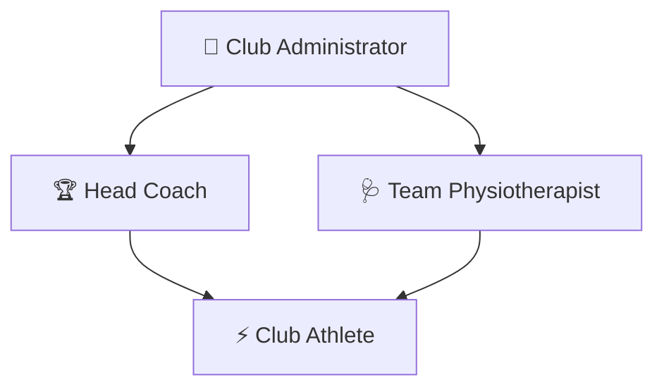
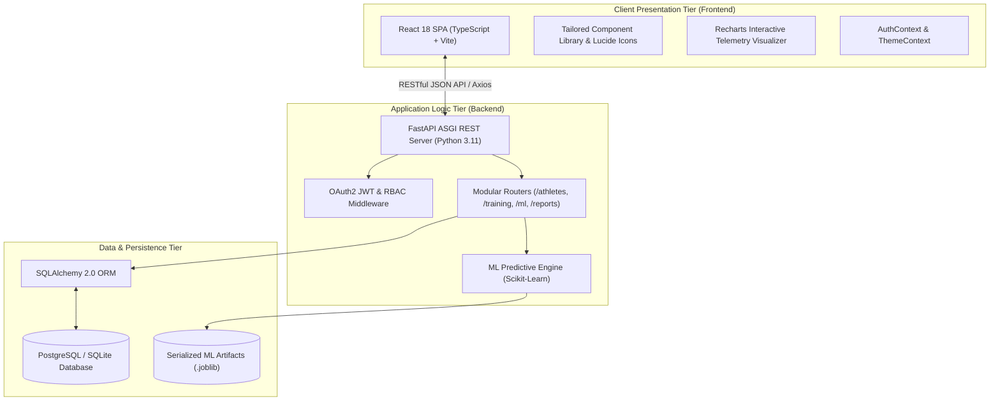
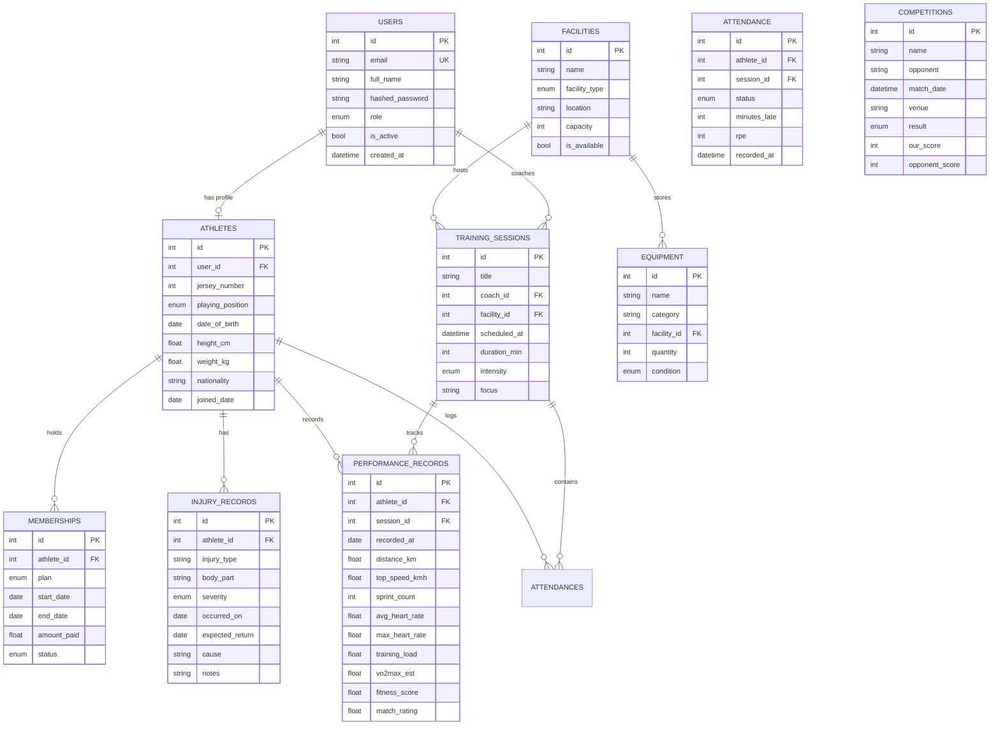
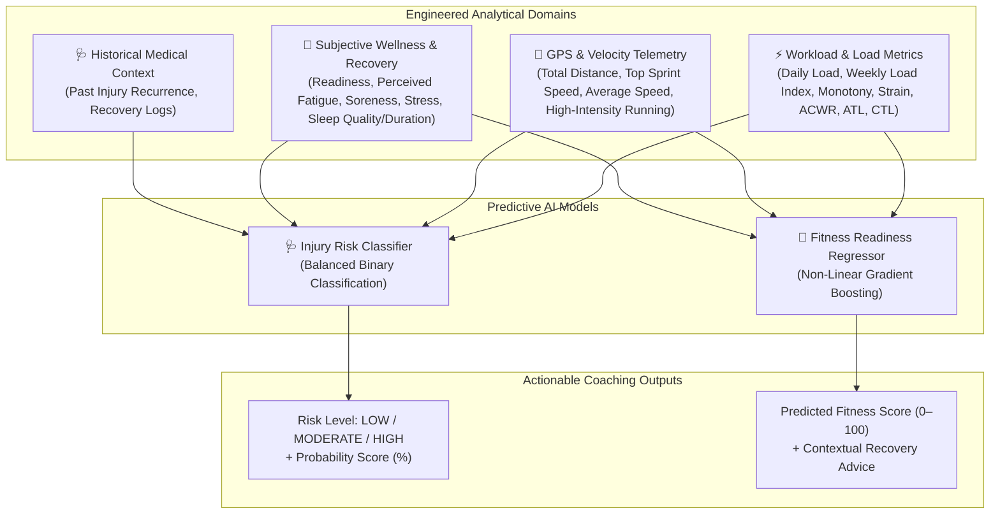
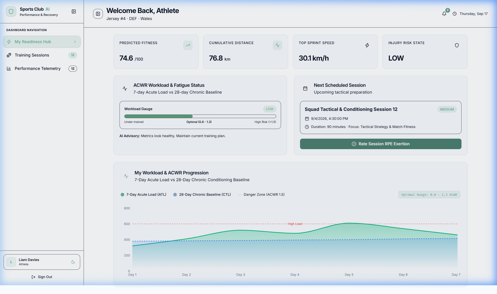
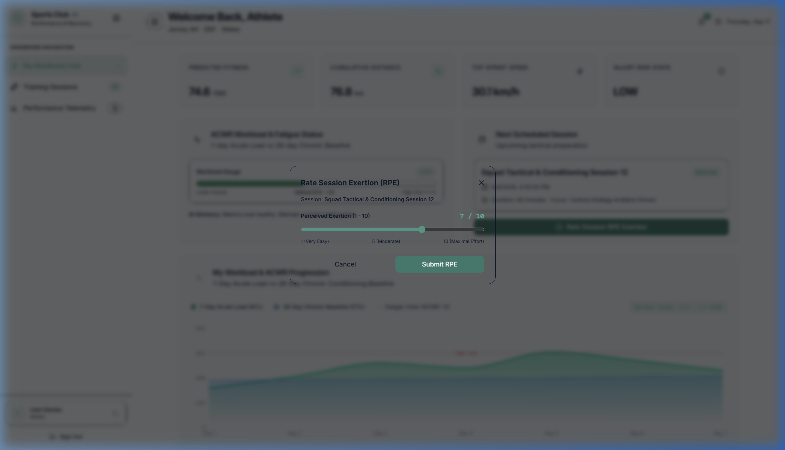
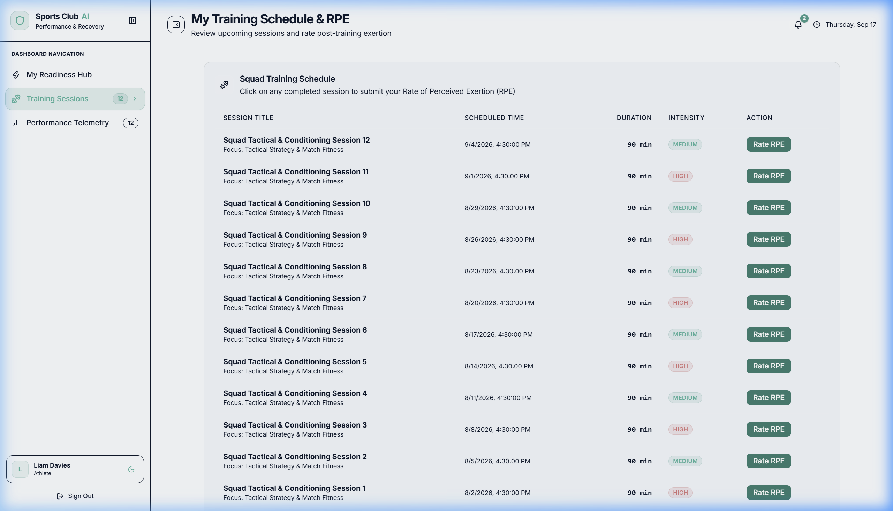
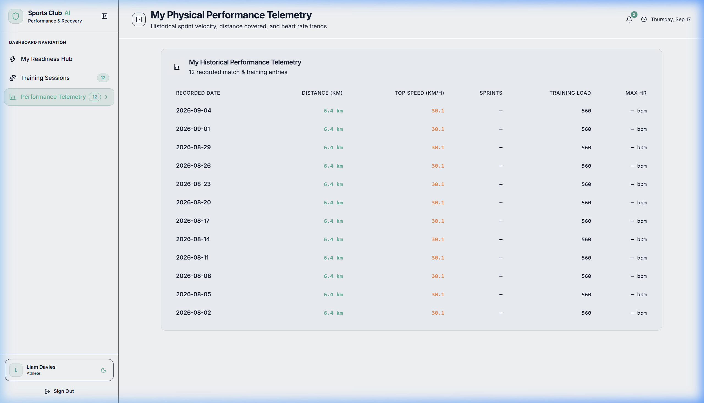

# 📋 Software Requirements Specification & System Design Document (SRS/SDD)

**Project Title**: Sports Club AI — Centralized Performance Management & Injury Risk Prediction System  
**Document Version**: 1.0.0  
**Project Phase**: System Requirements & Architectural Design Milestone  
**Target Audience**: Academic Project Advisor, Review Committee, and Engineering Team  

---

## 📑 Table of Contents
1. [Executive Summary & Project Objectives](#1-executive-summary--project-objectives)
2. [Stakeholder Profiles & User Roles (RBAC)](#2-stakeholder-profiles--user-roles-rbac)
3. [Functional Requirements (FR)](#3-functional-requirements-fr)
4. [Non-Functional Requirements (NFR)](#4-non-functional-requirements-nfr)
5. [System Architecture & 3-Tier Design](#5-system-architecture--3-tier-design)
6. [Database Design & Entity-Relationship Diagram (ERD)](#6-database-design--entity-relationship-diagram-erd)
7. [Machine Learning & Mathematical Formulations](#7-machine-learning--mathematical-formulations)
8. [UI/UX Design Specifications & User Flows](#8-uiux-design-specifications--user-flows)
9. [Future Scalability: Multi-Club SaaS Architecture](#9-future-scalability-multi-club-saas-architecture)
10. [Team Workload Division & 4-Member Allocation](#10-team-workload-division--4-member-allocation)

---

## 1. Executive Summary & Project Objectives

### 1.1 Problem Statement
Modern athletic organizations face two critical operational challenges:
1. **Fragmented Operations**: Training schedules, medical reports, athlete attendance, facility bookings, and membership tracking are typically scattered across disconnected spreadsheets and paper logs.
2. **Preventable Soft-Tissue Injuries**: Athletes frequently experience non-contact soft-tissue injuries (e.g., hamstring strains, calf tears) caused by unmonitored workload spikes and acute fatigue.

### 1.2 Project Objectives
- Build a centralized, web-based sports management system unifying administration, coaching, medical clearance, and athlete tracking.
- Embed a Machine Learning (ML) engine that analyzes rolling **Acute:Chronic Workload Ratios (ACWR)**, GPS velocity metrics, and subjective wellness data to provide early injury warnings and performance forecasting.
- Deliver a responsive, role-based application adhering to strict data privacy and professional sports science standards.

---

## 2. Stakeholder Profiles & User Roles (RBAC)

The system enforces a clean Role-Based Access Control (RBAC) hierarchy across club stakeholders:

| User Role | Primary Responsibilities | Access Scope |
| :--- | :--- | :--- |
| 👑 **Administrator** | User account provisioning, role assignments, facility management, and system-wide CSV audit exports. | Full System CRUD |
| 🏆 **Head Coach** | Squad roster oversight, training session scheduling, telemetry analysis, and AI risk alerts. | Squad & Training Read/Write |
| 🩺 **Physiotherapist** | Medical injury logging, clinical severity grading, and 1-click Return-to-Play medical clearance. | Medical Read/Write |
| ⚡ **Athlete** | Self-service portal, personal attendance logs, RPE exertion rating, and private ACWR recovery gauge. | Self Private Read/Write |
| 📋 **Staff** | General facility management, equipment inventory tracking, and operational logging. | Operations Read/Write |

---

## 3. Functional Requirements (FR)

### Domain 1: Authentication & Security (FR-1)
- **FR-1.1**: The system shall authenticate users via OAuth2 with encrypted JSON Web Tokens (JWT).
- **FR-1.2**: Passwords shall be hashed using `bcrypt` prior to database storage.
- **FR-1.3**: The system shall enforce endpoint-level RBAC decorators preventing unauthorized cross-role data access.

### Domain 2: Squad & Athlete Management (FR-2)
- **FR-2.1**: The system shall maintain athlete profiles with jersey number, position, DOB, height, weight, and nationality.
- **FR-2.2**: The coach interface shall provide dynamic search, sorting, and positional filtering (`GK`, `DEF`, `MID`, `FWD`).
- **FR-2.3**: The system shall display aggregated squad telemetry (average distance, top sprint velocities, and match ratings).

### Domain 3: Training Scheduling & Attendance (FR-3)
- **FR-3.1**: Coaches shall be able to schedule sessions with title, date/time, duration (min), facility, and intensity level.
- **FR-3.2**: The system shall record athlete attendance status (`present`, `late`, `absent`, `excused`) and minutes late.
- **FR-3.3**: The system shall allow logging of **Rate of Perceived Exertion (RPE 1–10)** to compute daily training load:
  $$\text{Training Load} = \text{Duration (min)} \times \text{RPE Score}$$

### Domain 4: Medical Center & Return-to-Play (FR-4)
- **FR-4.1**: Physiotherapists shall log injury records with injury type, body part, severity (`minor`, `moderate`, `severe`), and date.
- **FR-4.2**: Injured athletes shall be automatically flagged with an active medical warning on the squad roster.
- **FR-4.3**: The system shall provide a 1-click **Return-to-Play (RTP)** clearance workflow to safely resolve active injuries.

### Domain 5: Facility & Equipment Operations (FR-5)
- **FR-5.1**: The system shall manage training grounds, pitches, and gyms with capacity limits and availability status toggles.
- **FR-5.2**: The system shall track equipment inventory quantities, categories, and condition states (`good`, `fair`, `damaged`).

### Domain 6: Machine Learning Predictive Intelligence (FR-6)
- **FR-6.1**: The system shall automatically compute the rolling 7-day Acute Load (ATL) and 28-day Chronic Load (CTL) to calculate the **ACWR**.
- **FR-6.2**: The system shall classify athlete injury risk into **`LOW`**, **`MODERATE`**, or **`HIGH`** tiers using a balanced classifier.
- **FR-6.3**: The system shall estimate athlete fitness readiness on a continuous scale ($0\text{--}100$).
- **FR-6.4**: The system shall output contextual, plain-English recovery recommendations for coaching staff.

### Domain 7: Reporting & Data Export (FR-7)
- **FR-7.1**: The system shall provide 1-click CSV data export for Users, Attendance, Facilities, and Memberships.

---

## 4. Non-Functional Requirements (NFR)

| ID | Requirement Area | Specification Target |
| :--- | :--- | :--- |
| **NFR-1** | **Performance & Latency** | REST API endpoints shall respond in $< 150\text{ ms}$; ML inference shall execute in $< 50\text{ ms}$. |
| **NFR-2** | **Security & Privacy** | Strict tenant/athlete data isolation; JWT expiration; no cleartext credentials. |
| **NFR-3** | **Scalability** | Asynchronous ASGI backend handling concurrent requests; stateless API layer. |
| **NFR-4** | **Data Integrity** | Foreign key constraints with cascading deletions; transactional ACID compliance. |
| **NFR-5** | **Usability & Aesthetics** | Modern responsive Single-Page Application (SPA); accessible Dark/Light theme modes. |

---

## 5. System Architecture & 3-Tier Design

The platform uses a decoupled, modern 3-Tier Architecture:

---

## 6. Database Design & Entity-Relationship Diagram (ERD)

The database schema consists of **10 interconnected relational entities**:

---

## 7. Machine Learning & Mathematical Formulations

### 7.1 Acute:Chronic Workload Ratio (ACWR) Formulation
The system calculates athlete fatigue and workload dynamics using rolling moving averages:

$$\text{ATL (Acute Training Load)} = \frac{1}{7} \sum_{i=1}^{7} \text{Daily Load}_i$$

$$\text{CTL (Chronic Training Load)} = \frac{1}{28} \sum_{i=1}^{28} \text{Daily Load}_i$$

$$\text{ACWR} = \frac{\text{ATL}}{\text{CTL}_{28}}$$

- **Optimal Safe Zone ("Sweet Spot")**: $0.8 \le \text{ACWR} \le 1.3$
- **Elevated Danger Zone**: $\text{ACWR} > 1.5$ (Elevated statistical risk of non-contact soft-tissue injury)

---

### 7.2 Predictive Feature Engineering Architecture
The machine learning pipeline ingests multi-dimensional athletic telemetry grouped into four core analytical domains:

---

### 7.3 Model Algorithms & Decision Logic
1. **Injury Risk Classifier**:
   - **Algorithm**: `Logistic Regression` with balanced class weights to prioritize recall/sensitivity in detecting high-fatigue injury states.
   - **Output**: Calibrated risk probability ($0\%\text{--}100\%$) categorized into actionable coaching risk bands.
2. **Fitness Readiness Regressor**:
   - **Algorithm**: `Gradient Boosting Regressor` mapping non-linear physical exertion trends to a standard match fitness score ($0\text{--}100$).
3. **Automated Recovery Recommendations**:
   - Algorithmic rule engine providing actionable coaching directives (e.g., active recovery, session tapering, or medical review).

---

## 8. UI/UX Design Specifications & User Flows

### 8.1 Design System Tokens
- **Typography**: Inter / Outfit modern sans-serif with clear typographic hierarchy.
- **Palette**: Deep slate dark mode (`#0f172a`, `#1e293b`), emerald green accents (`#10b981`), amber warning highlights (`#f59e0b`), and crimson danger alerts (`#ef4444`).
- **Interactive Feedback**: Micro-animations on card hover, loading spinners, and toast notifications.

### 8.2 Role-Based Screen Flows
1. **Coach Screen Flow**: Overview Dashboard $\rightarrow$ Squad Roster $\rightarrow$ Positional Filter $\rightarrow$ Training Drill Scheduler $\rightarrow$ Performance Telemetry $\rightarrow$ AI Risk Analytics $\rightarrow$ Match Fixtures.
2. **Physio Screen Flow**: Operations Overview $\rightarrow$ Medical Incident Center $\rightarrow$ Injury Logging Modal $\rightarrow$ Severity Assignment $\rightarrow$ 1-Click RTP Clearance $\rightarrow$ Facility Maintenance.
3. **Admin Screen Flow**: System Overview $\rightarrow$ User Management Directory $\rightarrow$ RBAC Account Creation $\rightarrow$ 1-Click CSV Audit Reports.
4. **Athlete Screen Flow**: Readiness Hub $\rightarrow$ Scheduled Sessions $\rightarrow$ RPE Exertion Slider $\rightarrow$ ACWR Recovery Gauge $\rightarrow$ Historical Telemetry.

#### Athlete Portal Showcase (Live UI Validations):

**1. Full Readiness Hub & Recharts Workload Curve**:

**2. Interactive Session RPE Exertion Rating Modal**:

**3. Training Sessions & Drills Schedule**:

**4. Historical Physical Performance Telemetry**:

### 8.3 Layout Architecture: Collapsible Left Vertical Navigation
- **Dual Display Modes**:
  - **Expanded Mode (Default)**: Full 280px vertical sidebar displaying club crest, labelled navigation tabs, live alert badge counters, user profile card, and quick theme switch.
  - **Compact / Hidden Mode (Toggleable)**: Collapsed 72px icon-only rail (or mobile full drawer) maximizing screen real estate for wide data tables, ACWR workload gauges, and analytical charts.
- **1-Click Panel Toggle**: Interactive panel collapse/expand button (`PanelLeftClose` / `PanelLeftOpen`) accessible from both the sidebar header and top workspace bar, with persistent user preference caching (`localStorage`).

---

## 9. Future Scalability: Multi-Club SaaS Architecture

The software architecture is engineered to scale from a single team tool to a **Multi-Club / League-Wide SaaS Platform** (e.g. English Premier League model):
- **Tenant Scoping**: Operational tables support tenant scoping via `club_id` for strict inter-club data isolation.
- **Federated Machine Learning**: Centralized predictive modeling capable of cross-club generalization while safeguarding tactical confidentiality.

---

## 10. Team Workload Division & 4-Member Allocation

| Team Member | Core Focus & Responsibilities | Key Deliverables & Modules |
| :--- | :--- | :--- |
| **Member 1** | **Machine Learning & Data Analysis** | Telemetry Data Preprocessing, Workload Feature Engineering, ACWR Calculation Engine, Injury Risk Classifier, Fitness Regressor, Predictive Pipeline Architecture, Model Evaluation Framework. |
| **Member 2** | **Frontend Development & UI / UX** | React 18 TypeScript SPA, Dynamic Dark/Light Theme System, Coach Squad Hub, Athlete Self-Service Portal, Interactive Recharts Telemetry Visualizations, Responsive UI Components. |
| **Member 3** | **Backend & Database Development** | FastAPI RESTful Service, PostgreSQL / SQLite Database Architecture, SQLAlchemy 2.0 ORM Entity Schemas, OAuth2 JWT Authentication, 5-Tier RBAC Permission Middleware, CSV Export Services. |
| **Member 4** | **Injury Management, Testing & Documentation** | Physiotherapy Medical Center, Clinical Severity Grading, 1-Click Return-to-Play (RTP) Clearance Workflows, Automated Pytest & Integration Testing Suite, SRS/SDD Technical Documentation, User Manuals. |

---

*Document prepared for academic project review and milestone defense.*
