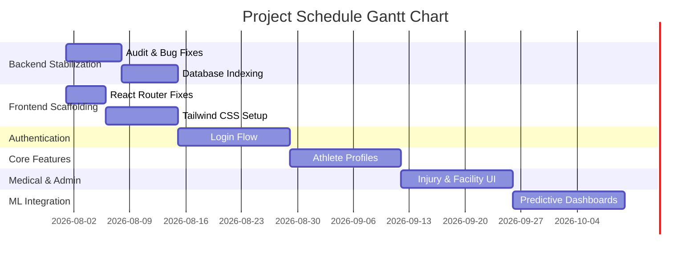

---
# COVER PAGE PLACEHOLDER
**Project Title**: Sports Club AI Platform - Predictive Management System
**Student Name/Team**: [Your Name/Team]
**Date**: July 2026
---

# Table of Contents
1. Introduction/Background
2. Statement of the Problem
3. General and Specific Objectives
4. Scope of the Project and Limitations
5. Methodology / Approach
6. Significance and Beneficiaries
7. Task Breakdown and Feasibility Analysis
8. Project Schedule / Timeline
9. References
10. Annexes

---

## 1. Introduction/Background
Modern sports clubs generate vast amounts of data ranging from athlete attendance and physiological metrics to facility availability. This data is often siloed, making it difficult for coaches and physiotherapists to make data-driven decisions. The inspiration for the Sports Club AI project stems from the need to centralize this data and leverage predictive analytics to minimize athlete injuries and maximize performance. The transition from traditional, paper-based or disjointed digital systems to an integrated AI platform provides a unique opportunity to fundamentally change how clubs operate.

## 2. Statement of the Problem
Sports clubs currently struggle with disparate systems for tracking athlete performance, injuries, and facility management. The lack of a centralized ecosystem means that coaches and medical staff cannot easily correlate training loads with injury risks. As a result, athletes are frequently overtrained, leading to preventable injuries and suboptimal match performance. Furthermore, administrative tasks such as facility booking and equipment maintenance are managed manually, leading to scheduling conflicts and resource mismanagement. 

## 3. General and Specific Objectives
**General Objective:**
To develop a unified, AI-driven sports club management system that centralizes club operations and utilizes machine learning to predict athlete injury risks and forecast performance fitness scores.

**Specific Objectives:**
- To implement a secure, Role-Based Access Control (RBAC) backend using FastAPI to support different user roles (Admin, Coach, Athlete, Physiotherapist, Staff).
- To develop a responsive frontend using React and Tailwind CSS for interactive data management.
- To engineer machine learning features (e.g., training load calculation via RPE and duration) and train Logistic and Linear Regression models using Scikit-Learn.
- To automate facility and equipment management tracking.
- To provide a comprehensive athlete performance and injury logging dashboard.

## 4. Scope of the Project and Limitations
**Scope (Delimitation of Work):**
The system will encompass user authentication, athlete profile management, training session scheduling, attendance tracking, injury logs, facility/equipment management, and a predictive machine learning dashboard. It is designed for use by a single sports club entity.

**Limitations:**
The project is bounded by the quality and quantity of historical training data available. Since the machine learning models (Logistic Regression for injury prediction, Linear Regression for fitness) rely heavily on accurate RPE (Rating of Perceived Exertion) and heart-rate data, inaccurate data entry by users will degrade prediction accuracy. Furthermore, real-time wearable device integration is outside the scope of this project phase due to hardware constraints; data will be manually inputted or batch-uploaded instead.

## 5. Methodology / Approach
The project follows an iterative Agile software development methodology. 
- **Requirements & Design Phase**: Stakeholder interviews to define Entity-Relationship models and OpenAPI schemas.
- **Backend Development**: Utilizing Python, FastAPI, and PostgreSQL for robust REST APIs. SQLAlchemy ORM is used for database interactions.
- **Frontend Development**: React 19 with TypeScript, utilizing Vite and Tailwind CSS.
- **Machine Learning Integration**: Scikit-Learn pipelines (standard scalers, classification/regression models) persist models as `.joblib` artifacts. Features are aggregated from historical PostgreSQL tables.
- **Testing & Deployment**: Automated API testing, React component testing, and deployment via Docker Compose.

## 6. Significance and Beneficiaries
**Beneficiaries:**
- **Coaches**: Can track attendance, monitor performance, and receive ML-driven recommendations for training loads.
- **Physiotherapists**: Gain a comprehensive injury logging system with predicted recovery paths, enabling preventative care.
- **Athletes**: Benefit from optimized training, reduced injury risks, and clear visibility into their fitness progress.
- **Club Administrators**: Streamline facility, equipment, and membership management.

**Significance:**
The actual utility of this project is a highly proactive, data-driven environment that maximizes athletic performance and extends athletes' careers by minimizing injury downtime.

## 7. Task Breakdown and Feasibility Analysis
**Feasibility:**
- **Technical**: Highly feasible. The backend architecture leverages modern frameworks (FastAPI) and proven tabular ML algorithms (Scikit-Learn).
- **Resource & Time**: The project is practical within the allocated timeframe, though frontend UI development will require significant resource focus due to current infrastructure gaps.

**Task Breakdown:**
1. **Backend Stabilization**: Resolve CORS configurations and implement DB indexing.
2. **Frontend Scaffolding**: Resolve React Router initialization crashes; setup Tailwind CSS.
3. **Authentication UI**: Build robust login flows with persistent session validation.
4. **Core Athlete & Training UI**: Develop Dashboards for profiles and attendance.
5. **Medical & Facility UI**: Build Injury, Equipment, and Facility management interfaces.
6. **Machine Learning Dashboard Integration**: Visualize fitness predictions and injury risk probabilities.

## 8. Project Schedule / Timeline
Below is the Gantt chart mapping out the scheduled tasks and expected outcomes.

*(Outcomes: Weeks 1-2 establish a stable base, Weeks 3-4 deliver core operational tools for coaches, Weeks 5-6 deliver medical/admin tools, and Weeks 7-8 deliver the predictive analytics engine.)*

## 9. References
- FastAPI Documentation: https://fastapi.tiangolo.com/
- React 19 & TypeScript: https://react.dev/
- Scikit-Learn (Logistic/Linear Regression): https://scikit-learn.org/
- Gabbett, T. J. (2016). The training—injury prevention paradox: should athletes be training smarter and harder? *British Journal of Sports Medicine*.

## 10. Annexes
- **Annex A**: Cover Page format details
- **Annex B**: Database Schema & Entity Relationship Diagram 
- **Annex C**: System Architecture & Tech Stack Details
